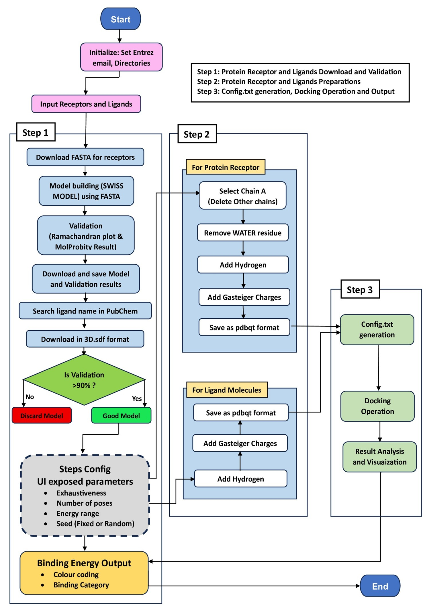
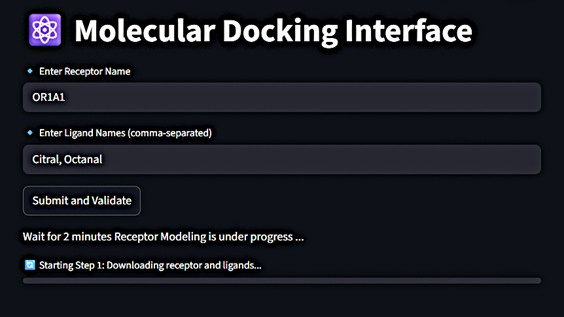
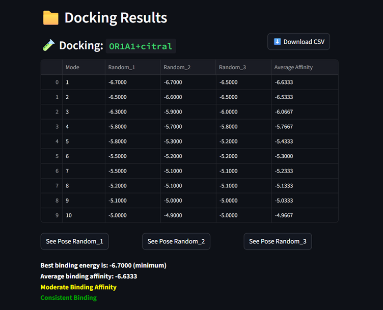
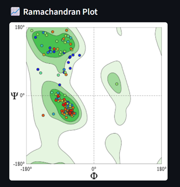
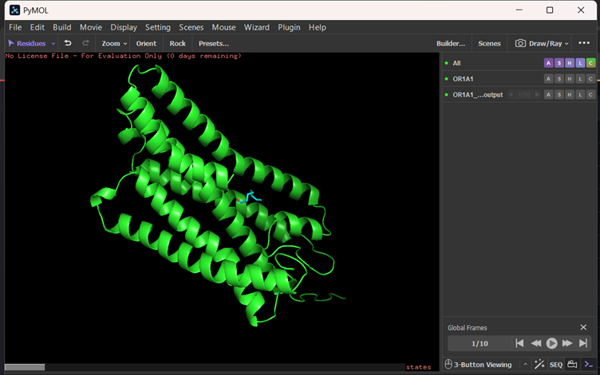

# 🧬 OdorSig: Automated Molecular Docking Pipeline

[](https://github.com/ODOR-SIG/Automated-Molecular-Docking/actions/workflows/tests.yml)
[](https://doi.org/10.5281/zenodo.17814494)


[](#)

---
## Overview

**OdorSig** is a fully automated, open-source Python pipeline for 
reproducible olfactory receptor–odorant molecular docking analysis. 
Applied to 40 human olfactory receptors and 12 structurally diverse 
odorants, OdorSig generated a large-scale 480-pair binding affinity 
dataset in which 81% of pairs demonstrated high docking reproducibility 
(σ < 0.2 kcal/mol) and 36 high-confidence strong binders 
(ΔG ≤ −7.0 kcal/mol) were identified.

The system integrates **AutoDock Vina, Open Babel, PyMOL, 
Biopython**, and a **Streamlit** interface to deliver an end-to-end 
workflow requiring only receptor and ligand names as input. By reporting 
mean binding energy (ΔGmean) and standard deviation (σ) across triplicate 
docking runs as first-class output metrics, OdorSig transforms stochastic 
docking outputs into consistent, comparable receptor–odorant interaction 
profiles.

Originally developed as part of ongoing PhD research in digital olfaction 
at **IIT Mandi, CHCi Lab**, OdorSig is optimized for reproducibility, 
accessibility, and high-throughput screening — making it suitable for 
applications in computational olfaction, cheminformatics, fragrance 
design, and chemosensory neuroscience.

> *"From sequence to docking — automated, reproducible, and 
researcher-friendly."*

---

## 🧪 Dataset

The complete **480-pair OR–odorant binding affinity dataset** generated by OdorSig is available in the [`dataset/`](./dataset/) folder.

- 40 human olfactory receptors × 12 structurally diverse odorants
- Per-run binding energies (ΔG), mean affinities, reproducibility scores (σ)
- H-bond counts and hydrophobic contact annotations
- Binding strength classification (strong / moderate / weak)

Also permanently archived at Zenodo:
[](https://doi.org/10.5281/zenodo.17814494)

---

## Key Features

- 🔹 **End-to-end automation** of receptor & ligand retrieval, preparation, validation, and docking
- 🔹 **Direct integration** with NCBI, PubChem & SWISS-MODEL
- 🔹 **Ramachandran plot–based validation** for receptor reliability
- 🔹 **Multi-run reproducibility scoring** — reports ΔGmean and σ for every pair
- 🔹 **480-pair large-scale dataset** across 40 ORs and 12 odorants
- 🔹 **Streamlit visual interface** (no command line needed)
- 🔹 **PyMOL visualization** of 3D docking poses
- 🔹 **Batch docking support** (multiple ligands → one receptor)
- 🔹 **Auto-generated Vina configuration files**
- 🔹 **CSV-based report export**
- 🔹 **Random/user-defined seed support** for reproducible docking
- 🔹 **Robust logging and error handling**

---

## System Workflow (Architecture)

The pipeline follows a modular, reproducible workflow:

1. **User Input** (Receptor ID, ligand names, seed mode)
2. **Data Retrieval**
   - Receptor → NCBI
   - Ligand → PubChem
   - Validation → SWISS-MODEL
3. **Structure Preparation** (Open Babel → `.pdbqt`)
4. **Model Validation** (Ramachandran plot, QMEAN, GMQE)
5. **Docking Configuration** (Grid box, exhaustiveness, seed)
6. **Docking Execution** (AutoDock Vina — triplicate runs)
7. **Reproducibility Analysis** (ΔGmean, ΔGmin, σ computed automatically)
8. **Results Parsing** (binding affinity, RMSD, binding class)
9. **Visualization** (PyMOL 3D pose view)
10. **Report Export** (CSV + images)



---

## 📸 Screenshots

### User Input Interface


### Docking Results


### Ramachandran Plot Validation


### Docking Pose Visualization


### 🎬 Demonstration Video
▶️ https://vimeo.com/1136320708?share=copy&fl=sv&fe=ci

---

## 🧬 Tools & Technologies

| Category | Tool / Library | Version | Purpose |
|----------|----------------|---------|---------|
| **Programming Language** | Python | 3.11+ | Core language for automation, computation, and application logic |
| **Docking Engine** | AutoDock Vina | 1.2.7 | Performs receptor–ligand docking and estimates binding affinities |
| **Structure Conversion** | Open Babel | 3.1.1 | Converts molecular formats and prepares `.pdbqt` files for docking |
| **Visualization** | PyMOL (Open-Source) | 3.1.0 | 3D visualization of receptor–ligand binding poses |
| **User Interface** | Streamlit | 1.35+ | Interactive web interface for running docking experiments |
| **Data Retrieval** | Biopython (Entrez) | 1.83+ | Retrieves receptor sequences from NCBI |
| | Requests | 2.32+ | Handles API calls and file downloads |
| | BeautifulSoup4 | 4.12+ | Parses biological and validation web data |
| **Automation** | Selenium | 4.23+ | Automates SWISS-MODEL submissions and model retrieval (driver resolved automatically via Selenium Manager) |
| | Subprocess | Built-in | Executes AutoDock Vina & Open Babel commands |
| **Data Processing** | Pandas | 2.2+ | Manages docking results and Excel/CSV report generation |
| | NumPy | 2.0+ | Numerical analysis and statistical calculations |
| | openpyxl / xlsxwriter | 3.1+ / 3.2+ | Reads/writes the `.xlsx` results workbook |
| **Plotting** | Matplotlib | 3.9+ | Figure generation (`dataset/generate_figures.py`) and validation plots |
| | SciPy | 1.11+ | Hierarchical clustering for the receptor–odorant affinity heatmap |
| **System Utilities** | OS, Shutil, Threading | Built-in | File management and task parallelization |
| **Version Control** | Git | 2.45+ | Source code version control |
| | GitHub | Cloud | Repository hosting and collaboration |

Every dependency listed above is declared in [`requirements.txt`](./requirements.txt) and actually imported somewhere in `code/` or `dataset/` — nothing here is aspirational.

---

## Development Environment

- **Operating System:** Windows, macOS, or Linux (developed on Windows; PyMOL/Selenium launch paths are cross-platform as of this release)
- **Python Version:** 3.11 or higher
- **IDE / Editor:** VS Code
- **External Dependencies:** AutoDock Vina, Open Babel, PyMOL

> *AutoDock Vina, Open Babel, and PyMOL must be installed and available on your `PATH`. No source file needs to be edited — see [Configuration](#4️⃣-configure-environment-variables) below.*

---

## Installation

### 1️⃣ System Requirements

| Component | Recommended Specification |
|-----------|--------------------------|
| **Operating System** | Windows, macOS, or Linux |
| **Python Version** | 3.11 or above |
| **RAM** | Minimum 8 GB (16 GB preferred) |
| **Storage** | ~2 GB free space |
| **Internet Connection** | Required for data retrieval (NCBI, PubChem, SWISS-MODEL) |

---

### 2️⃣ Prerequisite Software

#### 🧬 AutoDock Vina
- Download: https://vina.scripps.edu/
- Extract and add the `vina` executable to your **PATH**

#### Open Babel
- Download: https://openbabel.org/wiki/Main_Page
- Add `obabel` to your **PATH**

#### PyMOL
- Download: https://pymol.org/
- Optional open-source install:
```bash
conda install -c schrodinger pymol
```

Google Chrome must also be installed; ChromeDriver is resolved automatically by Selenium Manager (Selenium >= 4.6) — no manual driver download needed.

### 3️⃣ Install Python Dependencies
```bash
pip install -r requirements.txt
```

### 4️⃣ Configure environment variables

```bash
cp .env.example .env
# edit .env and set ODORSIG_ENTREZ_EMAIL to a real contact email (required by NCBI)
export $(grep -v '^#' .env | xargs)   # or use a tool like python-dotenv / direnv
```

No paths are hardcoded in source: `ODORSIG_ENTREZ_EMAIL` is the only required variable. Everything else (Vina/Open Babel/PyMOL locations, output directories, ChromeDriver) has a working default — see `.env.example` and `code/Automation_code/config.py` for the full list of overrides.

---

## Usage

Run the Streamlit interface:
```bash
cd code
streamlit run app.py
```

Regenerate the large-scale 480-pair dataset (requires `ODORSIG_PAIR_LIST_XLSX` pointing at a receptor/ligand pair list — see `dataset/README_dataset.md`):
```bash
cd dataset
python code.py
```

Reproduce the dataset figures (heatmap, boxplot, classification, reproducibility, Ramachandran) from the deposited results:
```bash
cd dataset
python generate_figures.py
```

---

## Example Docking Output

| Pose | Binding Energy (kcal/mol) | RMSD | Notes |
|------|--------------------------|------|-------|
| 1 | -7.6 | 0.0 | Best pose |
| 2 | -6.9 | 1.2 | Alternative pose |
| 3 | -6.4 | 2.1 | Less stable |

---

## Citation

If you use OdorSig in scientific research, please cite:
```bibtex
@software{bajpai2025odorsig,
  author    = {Bajpai, Divyanshu and Pal, Atirath and Roy Chowdhury, Shubhajit},
  title     = {OdorSig: Automated Molecular Docking Pipeline},
  year      = {2025},
  publisher = {ODOR-SIG},
  version   = {1.0.0},
  doi       = {10.5281/zenodo.17814494},
  url       = {https://github.com/ODOR-SIG/Automated-Molecular-Docking},
}
```

---

## Code Availability

Complete source code: **https://github.com/ODOR-SIG/Automated-Molecular-Docking**

DOI-versioned archival release on Zenodo: **https://doi.org/10.5281/zenodo.17814494**

---

## License

Released under the **MIT License**. See the `LICENSE` file for details.

---

## Authors

## Authors

**Divyanshu Bajpai**
PhD Researcher, Computational CHCi Lab
Indian Institute of Technology Mandi, Himachal Pradesh, India

**Atirath Pal**
Research Intern, Computational CHCi Lab
Indian Institute of Technology Mandi, Himachal Pradesh, India

**Shubhajit Roy Chowdhury**
Professor, CHCi Lab
Indian Institute of Technology Mandi, Himachal Pradesh, India

*Digital Smell Technology Research Group
Centre for Human-Computer Interaction (CHCi)
Indian Institute of Technology Mandi*
